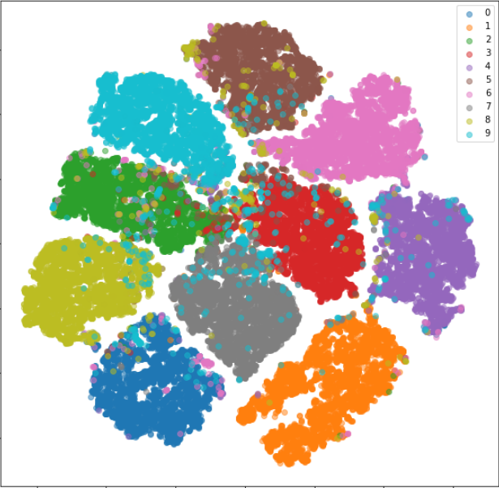
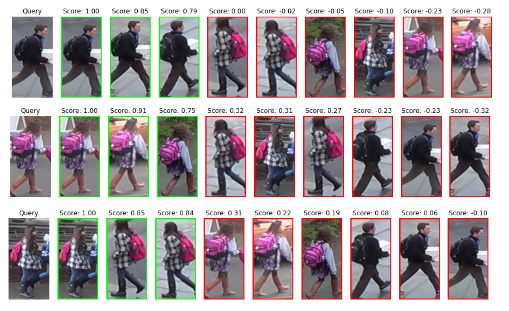
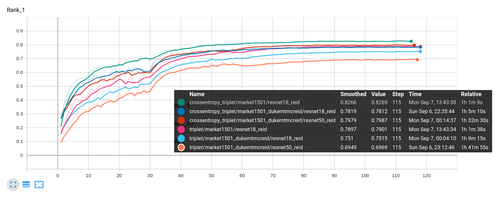
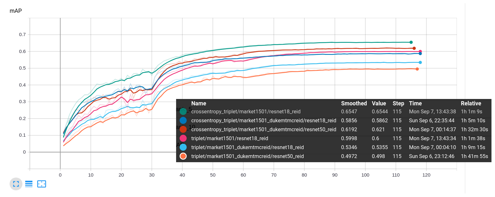

# trytry-reid

Person reidentification is about learning feature representations of different people with their own images under different environment conditions. **we want feature representations of different people are far away in the embedding space (euclidean space)**.

Here is an example of visualizing the trained embeddings of mnist digits with TSNE. (Model is trained with triplet loss)



In practice, we will train a CNN model (e.g resnet50) with **crossentropy loss** or **triplet loss**. The former considers the task as a classification task, and the later considers the task as a metric learning task. After training, we will only use the latent features to compute affinity scores between entities in inference time. Given the affinity score, we can conclude if two different entities are similiar to each other.

Here is the result of using model trained on `market1501` dataset to perform ranking operatoin on `DukeMTMC-ReID` dataset.




## TODO LIST
- [ ] Verify whether the computation of metric value is correct or not
- [ ] Add center loss
- [ ] Add warmup lr scheduler

## Training ReID model with market1501 from scratch
```bash
$ python main.py --config config/resnet_softtrip.yml
```

## Training Tips
- Use CNN model pretrained on ImageNet (e.g resnet50) as the backbone of feature extractor (transfer learning)
- Modify the stride option of last layer of CNN model from (2, 2) to (1, 1) (resolution matters)
- Drop the classifier layer of the pretrained CNN model, and add the embedding layer (Linear layer) after feature extractor layer
- L2 norm the embedding layer (for cosine metric)
- Design a balanced batch sampler so that in each mini-batch, there are `K` images of `P` different entities respectively
- Use `RandomNegativeTripletSelector` rather than `HardestNegativeTripletSelector` and `SemihardNegativeTripletSelector` with fixed training policy (**If you train your model with triplet loss**)
- In addition to the triplet loss, the number of valid triplet samples in each batch is also an indicator to see whether the training is converge or not (**The loss value might converge to the margin you specified, but if the number of valid triplet samples is still decreasing means the model is still learning something.**)
- Train the model with both crossentropy loss and triplet loss

## ReID with Crossentropy Loss
- Advantages
    - Easy to implement
    - Effective when the dataset is small
- Disadvantages
    - Need to modify the architecture of model to train on different dataset (Final classifier layer needs to be modified)
    - Not scalable to large dataset
    - Training time is long

## ReID with Triplet Loss
- Advantages
    - Scalable to training dataset
    - Don't need to modify the architecture to adapt to new dataset
    - Training time is fast
- Disadvantages
    - Training is less stable (**embeddings often collapse to single point because of poor sampling strategy or wrong implementation of triplet loss or too large learning rate**)

## Tensorboard
- Rank@1 Accuracy


- mAP


## Reference
- https://openaccess.thecvf.com/content_CVPRW_2019/papers/TRMTMCT/Luo_Bag_of_Tricks_and_a_Strong_Baseline_for_Deep_Person_CVPRW_2019_paper.pdf
